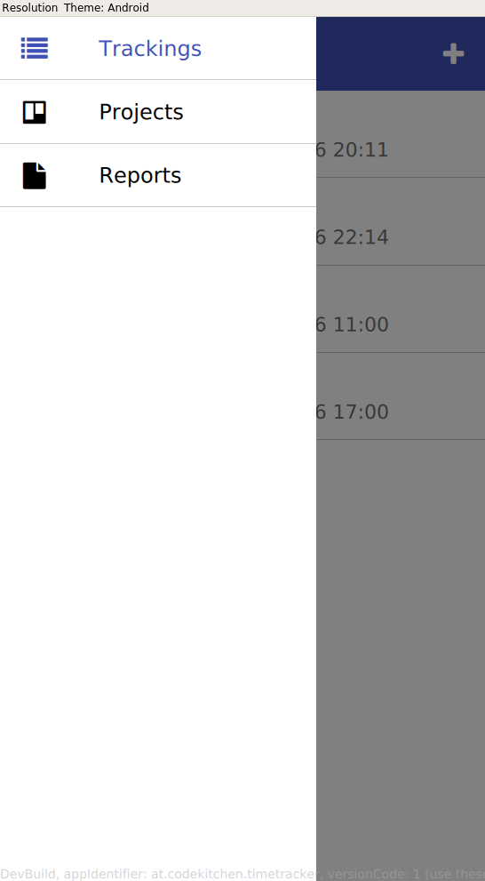

<?xml version="1.0" encoding="UTF-8"?>
<!DOCTYPE html>
<html lang="en">
<head>
  <meta http-equiv="Content-Type" content="text/html; charset=utf-8" />
<!-- timetracker.qdoc -->
  <title>Simple Timetracker Tutorial | Qt </title>
</head>
<body>
<li>Simple Timetracker Tutorial</li>

<h3><a name="toc">Contents</a></h3>
<ul>
<li class="level1"><a href="#goal">Goal</a></li>
<li class="level1"><a href="#let-s-get-started">Let's get started</a></li>
<li class="level1"><a href="#structure">Structure</a></li>
<li class="level1"><a href="#database">Database</a></li>
<li class="level1"><a href="#screen-projectspage">Screen ProjectsPage</a></li>
<li class="level1"><a href="#screen-trackingspage">Screen TrackingsPage</a></li>
</ul>

<h1 class="title">Simple Timetracker Tutorial</h1>

<!-- $$$timetracker-description -->

 

This tutorial will show you how to use V-Play-Apps and QtQuick for creating a simple timetracking application.

<h2 id="goal">Goal</h2>

The goal of this tutorial is creating a data-based mobile app. We want to have the possibility to add and configure projects, where we can then add timetrackings. We want to persist this data in a local storage. For this purpose we will use <b>Qt Quick Local Storage</b>. <b>Qt Quick Local Storage</b> uses a local sqlite database for saving the data. The tutorial will also cover how navigation between different screens in V-Play-Apps works. We will also build some new controls, like a timepicker which is used for selecting a time.

<h2 id="let-s-get-started">Let's get started</h2>

For creating a new V-Play-App we go to <b>File -&gt; New File Or Project</b> and then select <b>Empty Application</b> in section <b>Project/V-Play Apps</b>. Select a appropriate project-name (I chose <b>timetracking</b>) and click <b>Next</b>. Choose the latest installed Qt-Version and click <b>Next</b>. In the next screen you have to enter the app display name and the app-identifier. I chose <b>Timetracker</b> and <b>at.codekitchen.timetracker</b>. Interface orientation can be let to <b>Auto</b>. Choose your prefered source code management tool in the next screen and click <b>Finish</b>

<h2 id="structure">Structure</h2>

We will provide the following top-level navigation-structure

<ul>
<li>Projects</li>
<li>Tracking</li>
<li>Reports</li>
</ul>

So we want to end up with something like this:

Now, let's dive into some code. Open the file <code>qml/Main.qml</code>

For top-level navigation we use the V-Play component <code>Navigation</code>. <code>Navigation</code> renders platform-specific, for example if you are on Android it renders a Drawer-based navigation. In iOS its a tab-based navigation.

So lets build up our top-level UI-Structure by removing whats currently inside <code>App</code> and add a <code>Navigation</code> component with 3x <code>NavigationItem</code> as its children for each Navigation Entry. <code>NavigationItem</code> can be parameterized with a title and an icon. For the icons we use the V-Play compontent IconType for getting nice FontAwesome icons.

<pre class="cpp">import VPlayApps 1.0

App {
    Navigation {
        NavigationItem {
            title: qsTr(&quot;Trackings&quot;)
            icon: IconType.list
        }

        NavigationItem {
            title: qsTr(&quot;Projects&quot;)
            icon: IconType.trello
        }

        NavigationItem{
            title: qsTr(&quot;Reports&quot;)
            icon: IconType.file
        }
    }
}</pre>

If we <b>Build an Run</b> our project we should see the top-level-navigation of our application.

<h2 id="database">Database</h2>

Before we get into programming our different screens, we should talk about the datastructures we use in our program.

We have a simple data structure:

<pre class="cpp">                                  +-------------------+
+-------------------+             | Track             |
| Project           |             +-------------------+
+-------------------+             |# comment          |
|# name             |             |# from             |
|# description      &lt;-------------+# to               |
+-------------------+             +-------------------+</pre>

We want to organize projects and we want to have timetrackings (track) which can be assigned to one of this projects. So lets create a new qml-file <code>qml/Database.qml</code> for encapsulating all our model/database logic.

In our <code>Database</code> component we need to create a database-connection to our <code>LocalStorage</code> (will be done in the <code>init</code> function). The result of the connection is saved in the local property db. We also hold two models: <code>projectModel</code> for managing projects and trackModel for managing our timetrackings.

For every model we also need some extra logic for handling the model &lt;-&gt; database logic

In this case we have to Daos (DataAccessObjects) which have following functions:

<ul>
<li><code>populate</code>: <i>populates the model from database</i></li>
<li><code>append(item)</code>: <i>appends an new item to the model</i></li>
<li><code>remove(index)</code>: <i>(removes an item from the model by given index}</i></li>
<li><code>save(index)</code>: <i>(saves an item from the model by given index)</i></li>
</ul>

For our <code>projectDao</code> we will implement also two helper functions for finding projects by their rowId

The base structure of this component should look like:

<pre class="cpp">Item {
    id: database
    property var db

    property ListModel projectModel: ListModel{}
    property ListModel trackModel: ListModel{}

    function init(){}

    property var projectDao : QtObject{
        function populate(){}
        function append(project){}
        function remove(modelIndex){}
        function save(modelIndex){}
        function getIndexByRowId(rowId){}
        function getProjectByRowId(rowId){}
    }

    property var trackDao: QtObject{
        function populate(){}
        function append(track){}
        function remove(modelIndex){}
        function save(modelIndex){}
    }

    Component.onCompleted: {
        database.init()
        database.projectDao.populate()
        database.trackDao.populate()
    }
}</pre>

Now we get into the individual functions. Let's start with the <code>init()</code>-function. In this function we need to do following things:

<ul>
<li>set up database connection</li>
<li>create database-structure (only on first startup)</li>
</ul>

For setting up our database connection we use the function <code>openDataBaseSync(…)</code> from the LocalStorage QML-component. After setting the connection up, we execute the create-statement for our database. You should use the 'IF NOT EXISTS'-clause on the create-statements, then the statement is only executed on the first startup of the application.

<pre class="cpp">function init(){
    db = LocalStorage.openDatabaseSync(&quot;TimeTrackingDB&quot;, &quot;1.0&quot;, &quot;Timetracking Database&quot;, 100000);
    db.transaction( function(tx) {
        tx.executeSql('CREATE TABLE IF NOT EXISTS PROJECT(id INTEGER PRIMARY KEY AUTOINCREMENT, name TEXT, description TEXT)')
        tx.executeSql('CREATE TABLE IF NOT EXISTS TRACK(id INTEGER PRIMARY KEY AUTOINCREMENT, comment TEXT, projectid INTEGER, start DATETIME, end DATETIME)')
    });
}</pre>

If we <b>Build and Run</b> our application after implementing the <code>init</code>-function and doesn't get any error, the connection succeeded and the database and its tables were created.

Now let's implement the playerDao and let's start with the <code>populate</code>-function:

<ul>
<li>We first check, if we our db property has a value. if not -&gt; return false</li>
<li>If we have a valid database-connection we start a transaction</li>
<li>In this transaction we execute the statement 'SELECT * FROM PROJECT' which returns all entries in table PROJECT</li>
<li>In the next step we iterate the result-set of this statement and add the project to our projectModel</li>
</ul>

As you can see, we also save us the <code>rowId</code> of the database-entry, so we can identify our project-item for updates and deletions. We use the javascript <code>parseInt</code> function for converting the id from the database to an int-value.

<pre class="cpp">function populate(){
    if(!db){ return false; }

    db.transaction(function(tx){
        var result = tx.executeSql('SELECT * FROM PROJECT')
        for(var i = 0; i &lt; result.rows.length; i++){
            var item = result.rows.item(i)
            projectModel.append({&quot;rowId&quot;: parseInt(item.id), &quot;name&quot;: item.name, &quot;description&quot;: item.description})
        }
    });
    return true;
}</pre>

In the next step we will take a look on the <code>append</code>-function:

<ul>
<li>For continuity we reset our name and description properties to an empty string, if they are undefined</li>
<li>In the next step we execute an INSERT-statement with our project-properties name and description</li>
<li>After the execution of the statement we save the retured rowId from the database and add the item to our model</li>
</ul>
<pre class="cpp">function append(project){
    project.name = project.name !== undefined ? project.name : &quot;&quot;
    project.description = project.description !== undefined ? project.description: &quot;&quot;
    db.transaction( function(tx) {
        var res = tx.executeSql('INSERT INTO PROJECT (name, description) VALUES(?, ?)', [project.name, project.description])
        //change rowId before inserting to model
        project.rowId = parseInt(res.insertId)
    })
    projectModel.append(project)
    return projectModel.count - 1
}</pre>

Now lets implement the remove function:

<ul>
<li>The remove-function takes the modelIndex as a parameter, so we take our project from the model with the given index</li>
<li>In the next step again open a database-transaction and execute the DELETE-statement</li>
<li>For checking the success of the delete-statement we check the rowsAffected property on our statement-result</li>
<li>If the deletion was successful, we remove the given project from our model and return true, otherwise we return false</li>
</ul>
<pre class="cpp">function remove(modelIndex){
    var project = projectModel.get(modelIndex)
    var success
    db.transaction( function(tx) {
        var res = tx.executeSql('DELETE FROM PROJECT WHERE id = ?', [project.rowId])
        success = res.rowsAffected &gt; 0
    })

    if(!success) { return false; }
    projectModel.remove(modelIndex)
    return true
}</pre>

In the next step of the <code>projectDao</code> implementation we implement the <code>save</code> function.

<ul>
<li>similar to the remove-function we first get the project from the model with the given index</li>
<li>In the next step we open a new database-transaction and execute the UPDATE-statement</li>
<li>If res.rowsAffected &gt; 0, we return true, otherwise we return false</li>
</ul>
<pre class="cpp">function save(modelIndex){
    var project = projectModel.get(modelIndex)
    var success
    db.transaction(function(tx){
        var res = tx.executeSql('UPDATE PROJECT SET name = ?, description = ? WHERE id = ?', [project.name, project.description, project.rowId])
        success = res.rowsAffected &gt; 0
    });
    return success
}</pre>

In the next step of the <code>projectDao</code> we'll implement our two helper functions

<ul>
<li>getIndexByRowId simply iterates all projects from the projectModel and return the index of the rowId matches</li>
<li>getProjectByRowId uses this function and just returns the project behind the found index</li>
</ul>
<pre class="cpp">function getIndexByRowId(rowId){
    for(var i = 0; i &lt; projectModel.count; i++){
    var project = projectModel.get(i)
    if(project.rowId === rowId)
        return i
    }
    return -1
}

function getProjectByRowId(rowId){
    var index = getIndexByRowId(rowId)
    if(index === -1)
        return undefined;
    return projectModel.get(index)
}</pre>

The DAO-Code for the trackDao is pretty similar to the projectModel. I'll outline the main differences, but I won't go into every function explicitly.

The main difference to the projectModel is, that we have to care about the relationship between the track and the project.

<ul>
<li>{In the function populate() we also save the projectRowId as our foreign-key}</li>
<li>{Our append function sets the default values for start, end and project(selects the last created project)}</li>
</ul>
<pre class="cpp">//holds all the model-functionality for trackModel
property var trackDao: QtObject{
    function populate(){
        if(!db){ return false; }
        db.transaction(function(tx){
            var result = tx.executeSql('SELECT * FROM TRACK')
            for(var i = 0; i &lt; result.rows.length; i++){
                var item = result.rows.item(i)
                trackModel.append({&quot;rowId&quot;: parseInt(item.id),
                                   &quot;comment&quot;: item.comment,
                                   &quot;projectRowId&quot;: item.projectid,
                                   &quot;start&quot;: item.start,
                                   &quot;end&quot;: item.end})
            }
        });
        return true;
    }

    function append(track){
        track.comment = track.comment !== undefined ? track.comment : &quot;&quot;
        track.start = new Date(Date.now())
        track.end = new Date(Date.now())

        var lastProject = projectModel.get(projectModel.count - 1)
        if (lastProject){
            track.projectRowId = lastProject.rowId
        }
        else{
            track.projectRowId = -1
        }

        var res
        db.transaction( function(tx) {
            res = tx.executeSql('INSERT INTO TRACK(comment, projectid, start, end) VALUES(?, ?, ?, ?)',
                                [track.comment, track.projectRowId, track.start, track.end])
            track.rowId = parseInt(res.insertId)
        })
        trackModel.insert(0, track)
        return 0
    }

    function remove(modelIndex){
        var track = trackModel.get(modelIndex)
        var success
        db.transaction( function(tx) {
            var res = tx.executeSql('DELETE FROM TRACK WHERE id = ?', [track.rowId])
            success = res.rowsAffected &gt; 0
        })
        if(!success) { return success; }
        trackModel.remove(modelIndex)
        return success
    }

    function save(modelIndex){
        var track = trackModel.get(modelIndex)
        var success
        db.transaction(function(tx){
            var res = tx.executeSql('UPDATE TRACK SET comment = ?, start = ?, end = ?, projectid = ? WHERE id = ?',
                                    [track.comment, track.start, track.end, track.projectRowId])
            success = res.rowsAffected &gt; 0
        });
        return success
    }
}</pre>

<h2 id="screen-projectspage">Screen ProjectsPage</h2>

We want to have a screen, where we can Add, Modify and Delete projects. When we go to the screen it should look like:

Let's create an empty QML-Component <code>ProjectsPage.qml</code> for our visual implementation.

After creating the new qml-file lets use it in our <code>Main.qml</code> component within a <code>NavigationStack</code> (needed for our Detail-Page)

<pre class="cpp">...

NavigationItem {
    title: qsTr(&quot;Projects&quot;)
    icon: IconType.trello

    NavigationStack{
        ProjectsPage{}
    }
}
...</pre>

Now lets dive into <code>ProjectsPage.qml</code>

Our toplevel-component is a <code>ListPage</code> where we set the title to 'Projects'

<pre class="cpp">ListPage {
    title: qsTr(&quot;Projects&quot;)
    ...
}</pre>

For adding new projects we add a &quot;+&quot; - Button to the rightBarItem

<pre class="cpp">ListPage{
    ...
    rightBarItem: IconButtonBarItem {
        icon: IconType.plus
    }
    ...</pre>

Now we need a <code>ListView</code> for showing our entries from the database.

Let's add a <code>AppListView</code>, which provides a nice device-independent <code>ListView</code>

<code>AppListView</code> takes our database.projectModel as a model and we use the <code>SimpleRow</code> delegate for displaying our data (text should be the (project)name, detailText the (project)description)

<pre class="cpp">ListPage{
    ...
    AppListView {
        id: appListView
        model: database.projectModel
        delegate: SimpleRow {
            text: name
            detailText: description
        }
    }
    ...</pre>

For using our database we need to instantiate it in global scope (<code>Main.qml</code>) In this step we also add the <code>id</code> app (we will need this later)

<pre class="cpp">App {
    id: app

    Database{
        id: database
    }
    ...</pre>

After this step we are able to show project-entries from the model (database)

In the next step we want to provide functionality for adding new projects.

So, let's add a function which opens a Dialog with a TextField for entering the name of the new project.

<code>InputDialog</code> is a V-Play Component which provides single and multiline InputDialogs. In this case we one need a singleline input so we use the function <code>inputTextSingleLine</code>. It takes the topel-level app, a title, a placeholder-text and a callback-function, where we can handle the users actions and inputs.

In the callback-function we check if &quot;Cancel&quot; was pressed (!ok) or the input-text is empty. If one of these conditions is true, we return and do nothing

Otherwise we call our <code>projectDao.append(..&#x2e;)</code> function.

<pre class="cpp">function createNewProject(){
    InputDialog.inputTextSingleLine(app,
                                    qsTr(&quot;Create new Project&quot;),
                                    qsTr(&quot;Project Name&quot;),
                                    function (ok, text) {
                                        if (!ok || text === &quot;&quot;) {
                                            return
                                        }
                                        database.projectDao.append({&quot;name&quot;: text, &quot;description&quot;: &quot;&quot;)
                                    })
}</pre>

Let's use this function on our rightBarItem in the onClicked event-handler:

<pre class="cpp">rightBarItem: IconButtonBarItem {
    ...
    onClicked: createNewProject()
}</pre>

Now we are able to create new projects by clicking the &quot;+&quot;-Button and filling the LineEdit.

In the next step we implement a DetailScreen for our ListView.

For this purpose we create a new component inside our <code>ProjectsPage</code> The component holds a page with the title 'Detail View'

We add two properties <code>projectIndex</code> + <code>project</code>. <code>projectIndex</code> is used as parameter for the DetailView

<pre class="cpp">ListPage {
    ...
    Component {
    id: detailView
        Page {
            id: page
            title: qsTr(&quot;Detail View&quot;)

            property int projectIndex
            property var project: database.projectModel.get(projectIndex)
        }
    }
    ...</pre>

For using this component we have to extend our implementation of our <code>AppListView</code> We add a function <code>switchTo(index)</code> for pushing our detailView to our navigationStack and use it in our <code>SimpleRow</code>-delegate

<pre class="cpp">AppListView {
    ...
    delegate: SimpleRow {
        ...
        onSelected: appListView.switchTo(index)
    }
    ...
    function switchTo(index) {
        navigationStack.push(detailView, { projectIndex: index })
    }
    ...</pre>

We can also change our <code>createNewProject</code> function to switch to the detail-screen after creating the new project

<pre class="cpp">function createNewProject(){
    ...
                                        appListView.switchTo(database.projectDao.append({&quot;name&quot;: text, &quot;description&quot;: &quot;&quot;}))
    ...
}</pre>

Now lets extend our DetailView for editing the project:

In the first step we add a <code>Column</code> container for providing all our labels and textfields:

For our Labels we create a new component <code>AppTextFieldLabel.qml</code> in a new folder <code>components</code> for preventing code-replication:

<pre class="cpp">AppText{
    font.pixelSize: sp(10)
    color: &quot;grey&quot;
}</pre>

We use the VPlay-App components <code>AppText</code> and <code>AppTextField</code> for the labels and textfields:

<pre class="cpp">Component {
    id: detailView
    Page {
        ...
        Column{
            spacing: dp(5)
            topPadding: dp(15)
            padding: dp(5)

            AppTextFieldLabel{
                id: projectNameLabel
                text: qsTr(&quot;Project Name:&quot;)
                width: col.width - 2 * col.spacing
            }

            AppTextField{
                id: projectNameTextField
                text:  project ? project.name : &quot;&quot;
                width: col.width - 2 * col.spacing
                onTextChanged: saveTimer.restart()
            }

            AppTextFieldLabel{
                id: projectDescriptionLabel
                text: qsTr(&quot;Project Description:&quot;)
                width: col.width - 2 * col.spacing
            }

            AppTextField{
                id: projectDescriptionTextField
                text:  project ? project.description: &quot;&quot;
                width: col.width - 2 * col.spacing
                onTextChanged: saveTimer.restart()
            }
        }
        ...</pre>

After that change, our DetailView shows the correct informations from the database, but editing still doesn't work correctly

We have to add the Bindings for 2-way-property binding (see: <a href="http://imaginativethinking.ca/bi-directional-data-binding-qt-quick/">http://imaginativethinking.ca/bi-directional-data-binding-qt-quick/</a>) and we add a timer for saving our changes (not too often ;))

<pre class="cpp">Binding{
    target: project
    property: &quot;name&quot;
    value: projectNameTextField.text
}

Binding{
    target: project
    property: &quot;description&quot;
    value: projectDescriptionTextField.text
}

Timer{
    id: saveTimer
    interval: 500
    running: false
    repeat: false
    onTriggered: database.projectDao.save(projectIndex)
}</pre>

We need to call this functions when our texts in the textfields gets changed

<pre class="cpp">AppTextField{
    id: projectNameTextField
    ...
    onTextChanged: saveTimer.restart()
}

AppTextField{
    id: projectDescriptionTextField
    ...
    onTextChanged: saveTimer.restart()
}</pre>

Our last task for the Project-Detail-View is adding a delete button:

In this case we create a new component <code>DeleteButton.qml</code> which encapsulates our DeleteButton. We use the <code>AppButton</code> component from V-Play-Apps with a remove-icon and text &quot;delete&quot; and some appropriate colors.

<pre class="cpp">AppButton{
    id: deleteButton
    text: qsTr(&quot;delete&quot;)
    icon: IconType.remove
    backgroundColor: &quot;red&quot;
    backgroundColorPressed: &quot;purple&quot;
}</pre>

Similar to the text creating we again use the <code>InputDialog</code> component for creating an Dialog. In this case we just want to confirm the deletion. If the user confirms the deletion, we use our model-functions to remove it

<pre class="cpp">Column{
    ...
    DeleteButton{
        id: deleteButton
        onClicked: {
            InputDialog.confirm(app,
               qsTr(&quot;Really wanna delete project %1?&quot;.arg(project.name)),
               function (ok) {
                   if (!ok) { return; }
                   database.projectDao.remove(page.projectIndex)
                   navigationStack.pop()
               })
        }
    }
}</pre>

Now we are done with the ProjectView.

<h2 id="screen-trackingspage">Screen TrackingsPage</h2>

<code>TrackingsPage</code> is pretty similar to <code>ProjectsPage</code>. It contains a <code>ListView</code> with all trackings, an Add-Button and a DetailView.

It should look like:

with a detail screen:

and a Date/Time-picker screen for changing date and time

Let's create a QML-component <code>TrackingsPage.qml</code>

Again, I won't go too much into the details, because its very similar to the ProjectsPage. Instead of opening a Dialog when clicking the &quot;+&quot;-Button, we directly append a new track to the model and switch to the DetailView for editing.

<pre class="cpp">ListPage{
    id: trackingsPage
    title: qsTr(&quot;Trackings&quot;)

    Component{
        id: detailView
        Page{
            title: qsTr(&quot;Detail View&quot;)
            property int trackIndex
            property var track: database.trackModel.get(trackIndex)
        }
    }

    rightBarItem: IconButtonBarItem {
        icon: IconType.plus
        onClicked: {
            appListView.switchTo(database.trackDao.append({comment: &quot;&quot;}))
        }
    }

    AppListView{
        id: appListView
        model: database.trackModel

        delegate: SimpleRow {
            text: &quot;Project: %1&quot;.arg(database.projectDao.getProjectByRowId(model.projectRowId))
            detailText: &quot;%1 (%2)&quot;.arg(Helpers.formatDate(model.start)).arg(model.comment)
            onSelected: appListView.switchTo(index)
        }

        function switchTo(index) {
            navigationStack.push(detailView, {trackingIndex: index })
        }
    }
}</pre>

In our <code>SimpleRow</code> delegate we use a helper-function formatDate(..&#x2e;) which we put in a new file <code>helpers.js</code> This function does the formatting of your date.

<pre class="cpp">.pragma library

function formatDate(dt)
{
    dt = new Date(dt);

    var formattedDate = '%1.%2.%3 %4:%5'
    .arg(padLeft(dt.getDate(), '0', 2))
    .arg(padLeft(dt.getMonth() + 1, '0', 2))
    .arg(dt.getFullYear())
    .arg(padLeft(dt.getHours(), '0', 2))
    .arg(padLeft(dt.getMinutes(), '0', 2))

    return formattedDate
}

function padLeft(str, ch, width)
{
    var s = String(str);

    while (s.length &lt; width)
    s = ch + s;

    return s;
}</pre>

Now we can use the <code>TrackingsPage</code> in <code>Main.qml</code>

<pre class="cpp">Navigation {
    NavigationItem {
        ...
        NavigationStack{
            TrackingsPage{}
        }
    }</pre>

In the next step we will create some components, which we will later on need for our TrackingsPage. We will start with the TimePicker.

Let's create a new file <code>TimePicker.qml</code> in the folder components.

The implementation of <code>TimePicker.qml</code> is pretty straight-forward

<ul>
<li>As top-level component we choose Item</li>
<li>Lets add a property visibleItem for configuring how many items should be shown in the tumbler-list</li>
<li>Create a Text-Component for our Tumbler-delegate which cares about the styling of the single text-line</li>
<li>Add a row with 2 Tumblers (one for hours, one four minutes) + identify them by setting an id</li>
<li>Lets add the property aliases currentHours and currentMinutes to our Tumblers curent index</li>
<li>For simpler usage we provide a new signal anyValueChanged which is fired by onCurrentHoursChanged and onCurrentMinutesChanged</li>
</ul>
<pre class="cpp">import VPlay 2.0
import QtQuick 2.7
import QtQuick.Controls 2.0

Item{
    height: dp(100)
    width: row.width

    property int visibleItems: 3
    property alias currentHours: hourTumbler.currentIndex
    property alias currentMinutes: minutesTumbler.currentIndex

    signal anyValueChanged

    onCurrentHoursChanged: anyValueChanged()
    onCurrentMinutesChanged: anyValueChanged()

    Component{
        id: tumblerDelegate
        Text{
            text: {
                if(modelData &lt; 10)
                    return &quot;0&quot; + modelData
                return modelData
            }
            horizontalAlignment: Text.AlignHCenter
            verticalAlignment: Text.AlignVCenter
            font.pixelSize: dp(20)
            opacity: 1.0 - Math.abs(Tumbler.displacement) / (visibleItems / 2)
        }
    }

    Row{
        id: row
        Tumbler {
            id: hourTumbler
            width: dp(50)
            model: 24
            delegate: tumblerDelegate
        }
        Tumbler {
            id: minutesTumbler
            width: dp(50)
            model: 60
            delegate: tumblerDelegate
        }
    }
}</pre>

Another component we will probably need at some more points will be a <code>AppTextFieldLabel</code> which is used for labeling controls on the screens.

We just set <code>font.pixelSize</code> and <code>color</code> to some appropriate values.

<pre class="cpp">import VPlayApps 1.0
import QtQuick 2.0

AppText{
    font.pixelSize: sp(10)
    color: &quot;grey&quot;
}</pre>

Now let' complete our <code>TrackingPage</code>. First of all, we will add a new Component inside our <code>ListPage</code>

<ul>
<li>We use a page with gets parameterized with 2 values: date and callback</li>
<li>date is the date/time we want to show and edit</li>
<li>callback is the function which is called which callback(date), when the date/time gets changed by the user</li>
<li>For this purpose we have the function returnDate which creates the date and calls the callback-function</li>
<li>We have a column with a QtQuick1 Calender and our own Component TimePicker inside a Flickable for a better overflow-behaviour</li>
<li>In the function Component.onCompleted we initilize our Component after dynamic loading</li>
</ul>
<pre class="cpp">...

Component{
    id: dateTimePickerView

    Page{
        id: page
        title: qsTr(&quot;Pick Date and Time&quot;)

        property var date
        property var callback

        function returnDate(){
            var date = calendar.selectedDate
            date.setHours(timePicker.currentHours)
            date.setMinutes(timePicker.currentMinutes)
            callback(date)
        }

        Flickable{
            anchors.fill: parent
            contentHeight: col.height
            interactive: contentHeight &gt; col.heightd

            Column{
                id: col
                padding: dp(15)
                spacing: padding
                anchors.left: parent.left
                anchors.right: parent.right

                QQC1.Calendar{
                    id: calendar
                    width: col.width / 4 * 3
                    height: width
                    anchors.horizontalCenter: parent.horizontalCenter
                    onSelectedDateChanged: page.returnDate()
                }

                TimePicker{
                    id: timePicker
                    anchors.horizontalCenter: parent.horizontalCenter
                    onAnyValueChanged: page.returnDate()
                }
            }
        }

        Component.onCompleted: {
            var date = page.date
            if(date.getTime() === 0){
                date = new Date(Date.now())
            }

            calendar.selectedDate = date
            timePicker.currentHours = date.getHours()
            timePicker.currentMinutes = date.getMinutes()
        }
    }
}
...</pre>

Now we have a working screen for choosing date and time, so lets change our DetailView and use the new component.

Now lets add some new code to our detailView:

<ul>
<li>We also need a Column for aranging our Labels, Combobox,..&#x2e;</li>
<li>Lets add the TextLabels, ComboBox, TextFields, DeleteButton to our Column</li>
<li>Delete-Button-behaviour is pretty similar to the ProjectsPage</li>
<li>Similar to dateTimePickerView we also uses a more imperative logic in this case</li>
<li>We have a function updateDateTimeTexts() which updates our textfields with the set dates</li>
<li>In Component.onCompleted we initialize our screen (update start/end-text + update combobox-value)</li>
<li>For ComboBox we use the onCurrentIndexChanged eventHandler for updating our model after change</li>
<li>We put some MouseAreas over the AppTextFields to prevent changing the text directly, instead we switch to the DateTimePickerView</li>
</ul>
<pre class="cpp">Component{
    ...
    Page{
        ...
        Column{
            id: col
            spacing: dp(5)
            topPadding: dp(15)
            padding: dp(5)
            anchors.fill: parent

            AppTextFieldLabel{
                id: projectComboBoxLabel
                text: qsTr(&quot;Project:&quot;)
                width: col.width - 2 * col.spacing
            }

            QQC2.ComboBox{
                id: projectComboBox
                textRole: &quot;name&quot;
                model: database.projectModel
                width: col.width - 2 * col.spacing
                currentIndex: -1

                onCurrentIndexChanged: {
                    if(currentIndex &lt; 0) {return;}
                    page.track.projectRowId = database.projectModel.get(currentIndex).rowId
                    database.trackDao.save(page.trackIndex)
                }
            }

            AppTextFieldLabel{
                id: startTextLabel
                text: qsTr(&quot;Start Time&quot;)
                width: col.width - 2 * col.spacing
            }

            AppTextField{
                id: startText
                width: col.width - 2 * col.spacing
                MouseArea{
                    anchors.fill: parent
                    onClicked: appListView.switchToDateTimePickerView(track.start, function(date){
                        page.track.start = date
                        database.trackDao.save(page.trackIndex)
                        page.updateDateTimeTexts()
                    });
                }
            }

            AppTextFieldLabel{
                id: endTextLabel
                text: qsTr(&quot;End Time&quot;)
                width: col.width - 2 * col.spacing
            }

            AppTextField{
                id: endText
                width: col.width - 2 * col.spacing
                MouseArea{
                    anchors.fill: parent
                    onClicked: appListView.switchToDateTimePickerView(track.end, function(date){
                        page.track.end = date
                        database.trackDao.save(page.trackIndex)
                        page.updateDateTimeTexts()
                    });
                }
            }

            DeleteButton{
                id: deleteButton
                anchors.horizontalCenter: parent.horizontalCenter
                onClicked: {
                    InputDialog.confirm(app,
                       qsTr(&quot;Really wanna delete this timetracking?&quot;),
                       function (ok) {
                           if (!ok) { return; }
                           database.trackDao.remove(page.trackIndex)
                           navigationStack.pop()
                       })
                }
            }

        }

        function updateDateTimeTexts(){
            if(!page.track){ return; }
            startText.text = page.track ? Helpers.formatDate(page.track.start) : &quot;&quot;
            endText.text = page.track ? Helpers.formatDate(page.track.end): &quot;&quot;
        }

        Component.onCompleted: {
            if(!page.track){ return; }
            updateDateTimeTexts()
            var index = database.projectDao.getIndexByRowId(page.track.projectRowId)
            projectComboBox.currentIndex = index
        }
    }
}</pre>

For switching to our new component DateTimePickerView we need some more functionality in our ListPage. Similar to switchTo(..&#x2e;) we now provide a function <code>switchToDateTimePickerView</code> for switching to our DateTimePickerView. We also do some changes on our text Property of <code>SimpleRow</code> We just return the project.name, if we can find a related project

<pre class="cpp">AppListView{
    ...
    delegate: SimpleRow {
        text: {
            var project = database.projectDao.getProjectByRowId(model.projectRowId)
            if(!project){ return &quot;&quot;;}
            return &quot;Project: %1&quot;.arg(project.name)
        }
        ...
    }

    function switchToDateTimePickerView(date, callback){
        navigationStack.push(dateTimePickerView, {date: date, callback: callback})
    }
}</pre>

In the last part of our tutorial we'll build a simple Report-View which sums up our worked hours per week.

It should look like:

where we can select a project, the result page should look like:

Let's create a new QML-File <code>ReportsPage.qml</code> and integrate it in <code>Main.qml</code> (the same way as <code>ProjectsPage.qml</code> and <code>TrackingsPage.qml</code>}

Let's add some content:

Again we use <code>ListPage</code> as our toplevel-component.

<ul>
<li>Add new Component reportResult which contains a simple Page with two paramaters (string projectName, var reportModel</li>
<li>Add a Column for our Report-Form</li>
<li>Add a QtQuickControls2 ComboBox and an AppButton for selecting a project and start the reporting</li>
</ul>
<pre class="cpp">ListPage {
    id: reportPage
    title: qsTr(&quot;Create report&quot;)

    Component {
        id: reportResult
        Page {
            id: page
            title: qsTr(&quot;Result&quot;)

            property string projectName
            property var reportModel
        }
    }

    Column{
        id: col
        anchors.fill: parent
        padding: dp(5)
        spacing: dp(5)

        QQC2.ComboBox{
            id: projectComboBox
            textRole: &quot;name&quot;
            model: database.projectModel
            width: col.width - 2 * col.spacing
        }

        AppButton{
            text: qsTr(&quot;show report&quot;)
        }
    }
}</pre>

For our reporting we need some functionality for extracting our report.

Let's go to <code>Database.qml</code> and add a function <code>getReport(..&#x2e;)</code>. In our function we again open an new database-transaction and execute a sql-statement which takes the sum over the difference of end and start and groups ther results per week.

After executing the statement we iterate the result and bring the result in a form, that is nice to use for iterating in QML.

<pre class="cpp">Item {
    id: database
    ...
    function getReport(projectRowId){
        var result
        db.transaction(function(tx){
            result = tx.executeSql('SELECT strftime(&quot;%W&quot;, START) AS week, ROUND(SUM(((julianday(END) - julianday(START))*24)), 2) as result FROM TRACK WHERE projectid = ? GROUP BY WEEK',
                   [projectRowId])
        });
        var report = []
        for(var i = 0; i &lt; result.rows.length; i++){
            var item = result.rows.item(i)
            report = report.concat(item)
        }
        return report
    }
    ...
}</pre>

Now we have the functionality for creating report for a certain project. Lets integrate it to our views.

So lets modify our <code>Component</code> &quot;pageResult&quot;

<ul>
<li>We start by adding a Column to our <code>Page</code></li>
<li>In this column we add a row with a Label and an AppText (text is set to our component-parameter projectName</li>
<li>For showing the results of our report we place another Column in our Column</li>
<li>In a repeater we iterate over our reportModel</li>
<li>Inside our Repeater we again add a Row for placing the label for the calendar-week and the computed result from our function we wrote before</li>
</ul>
<pre class="cpp">Component {
    id: reportResult
    Page {
        id: page
        title: qsTr(&quot;Result&quot;)

        property string projectName
        property var reportModel

        Column{
            id: col
            anchors.fill: parent
            padding: dp(10)
            spacing: dp(10)

            Row{
                spacing: dp(5)
                AppTextFieldLabel{
                    id: projectNameTextLabel
                    text: qsTr(&quot;Project Name:&quot;)
                }

                AppText{
                    id: projectNameText
                    text: projectName
                    anchors.baseline: projectNameTextLabel.baseline
                }
            }

            Column{
                spacing: dp(7)
                Repeater{
                    model: reportModel ? reportModel : 0
                    Row{
                        spacing: dp(5)
                        AppTextFieldLabel{
                            id: calendarWeekText
                            text: &quot;KW&quot;+ modelData.week + &quot;:&quot;
                        }

                        AppText{
                            id: weekTotalText
                            text: modelData.result + &quot;h&quot;
                            anchors.baseline: calendarWeekText.baseline
                        }
                    }
                }
            }
        }
    }
}</pre>

<!-- @@@timetracker -->
</body>
</html>
